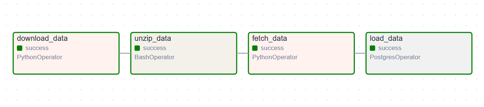
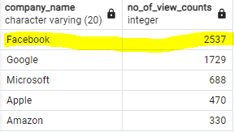

# Data Pipeline Orchestration with Apache Airflow

This project is a partial fulfilment requirement of my participation in the **CDE BootCamp Cohort 1**

#### Objective

This project is designed to reinforce my understanding of Data Pipeline Orchestration with Apache Airflow. The focus is on implementing a data pipeline 
that addresses data ingestion, processing, storage, and analysis. This project challenges me to apply my knowledge of Apache Airflow to solve a practical 
scenario based problem.

#### Project scenario

A data consulting organization is looking at building a stock market prediction tool that applies sentiment analysis, called **CoreSentiment**. 
To perform this sentiment analysis, they plan to leverage the data about the number of `Wikipedia page views` a company has (Wikipedia is one the largest 
public information resources on the internet). To make things simple, they assume that an *increase* in a company’s website page views shows a 
***positive sentiment***, and the company’s stock is likely to increase. On the other hand, a *decrease* in pageviews shows a ***negative sentiment*** and tells
us a loss in interest, and the stock price is likely to decrease.

*N.B:* The Wikipedia pageviews data can be found here https://dumps.wikimedia.org/other/pageviews. The technical details of Wikipedia pageviews data is documented 
here: [technical details](https://wikitech.wikimedia.org/wiki/Analytics/Data_Lake/Traffic/Pageviews).

## Methodology

This involves creating of a DAG (Direct Acyclic Graph) using Airflow that pulls the Wikipedia pageview counts by downloading, extracting, and reading the pageview 
data for any one hour duration on any date in October 2024 (in this case, 3pm data for 18th of October, 2024). To further streamline my analysis, I have selected 
just five companies (Google, Facebook, Apple, Amazon, and Microsoft) from the data extracted in order to initially track and validate the hypothesis. The ETL 
(Extract, Transform, Load) processes involved are explained below.

### Extract Stage:

The required data for this project can be downloaded from [here](https://dumps.wikimedia.org/other/pageviews/2024/2024-10/pageviews-20241018-150000.gz). 
A *PythonOperator* is applied on a *pythonFunction* to download the `.gz` file to a folder. A *BashOperator* is then used with a *bashCommand* to unzip the file
within the folder.

### Transform Stage:

The unzipped file is accessed using a *pythonFunction* which fetches only the selected company names (column `company_name`) and their aggregated pageview counts 
(column `no_of_view_counts`) and a generated column, `loaded_at`; after which it also writes a SQL `INSERT INTO` statements to a script file which would be used 
to load data into postgresDB. A *PythonOperator* is again used to access the *pythonFunction*. 

### Load Stage:

The transformed data is loaded into postgresDB using the insertion script created in the load stage (*Note: A CREATE TABLE script is applied within the task*). 
The postgresDB is localized (on localhost), this connection is achieved using a *PostgresOperator* and creating the connection details within Airflow using its GUI.

### Airflow Section:

Apache Airflow is used to achieve Data Pipeline Orchestration for this project. 

I started by importing all the necessary modules required. Then, instantiating a DAG with all the required arguments. After all these had been set up, four tasks
were created to carry out the Orchestration. The tasks dependencies are seen below...

`download_data >> unzip_data >> fetch_data >> load_data`

`download_data` and `unzip_data` for Extraction, `fetch_data` for Transformation and `load_data` for Loading.

### Analysis Section:

The company with the highest number of view counts for the period 15:00 to 16:00 GMT on the 18th of October, 2024 is `FACEBOOK` with `2537` views.

See the query and result below...

			SELECT company_name, no_of_view_counts
			FROM Core_sentiments
			ORDER BY 2 DESC
			LIMIT 1;
	
	
	

**N.B:** The `CoreSentiment_Airflow_Project.pdf` for this project is provided within.

